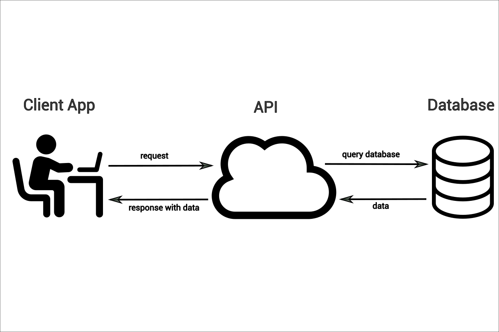

# Open Data for Cities and Climate

## Objectives

After completing this chapter, you will have an understanding of what open data is,
common formats and platforms for accessing open geospatial data, and how to evaluate the
quality and suitability of open datasets for local use.

## What is Open Data?

This is a book about using data to help cities make better decisions about climate risk.
While there are various potential sources for those data, in this book we focus on
*open* data. Toward the end of this chapter, we'll talk a bit about the complexities of
what open data look like in the real world, but for now we'll start with a basic working
definition that open data is data that anyone can "freely access, use, modify, and share
for any purpose."^[https://opendefinition.org/]. To clarify what this means, it might
help to begin with a couple of concrete examples. Here are some open data portals from
the U.S. government, the government of India, and the government of the City of Buenos
Aires:

| Portal                                                             | Description                        |
| ------------------------------------------------------------------ | ---------------------------------- |
| [data.gov](https://data.gov/)                                      | U.S. federal open data portal      |
| [data.gov.in](https://www.data.gov.in/)                            | India national open data portal    |
| [Catálogo de Datos GBA](https://catalogo.datos.gba.gov.ar/dataset) | Buenos Aires Province data catalog |

You'll notice that these portals are all government portals, which isn't an accident.
The idea of publicly-accessible data is old, but [the "open data"
movement](https://en.wikipedia.org/wiki/Open_data) tends to refer to a particular
initiative that emerged in the 2010s and focused primarily on open *government* data. As
such, national, regional, and local governments are some of the main publishers of open
data.

::: {.callout-tip}
## Try it yourself

Find an open data portal for your national, regional, or local government. What datasets
can you find in it? Is it well maintained? Can you find any datasets that you can see
yourself using for your work?
:::

Beyond governments, open data are often published by quasi-governmental institutions
like the United Nations, as well as by government-funded research organizations like the
European Research Commission's Joint Research Centre. Open data are also shared by many
scientific researchers, not just for reproducibility but for real-world use. Here are
some examples that are particularly relevant to urban climate
risk:^[Many of these sources also have plugins to import data directly in QGIS.]

| Source                                                                   | Description                                                                                                                 |
| ------------------------------------------------------------------------ | --------------------------------------------------------------------------------------------------------------------------- |
| [OpenStreetMap](https://www.openstreetmap.org/)                          | Community-generated geographic data; strong for roads and buildings in urban areas, but coverage and quality vary by region |
| [Overture Maps](https://docs.overturemaps.org/guides/)                   | Open map data combining contributions from multiple sources into a single, validated dataset                                |
| [Google Earth Engine](https://earthengine.google.com/)                   | Platform for satellite imagery and geospatial analysis; free for research and non-commercial use                            |
| [GEE Community Catalog](https://gee-community-catalog.org/)              | Community-curated datasets not in the official Earth Engine catalog; excellent for specialized climate data                 |
| [OpenLandMap](https://openlandmap.org/)                                  | Global environmental layers (soil, climate, vegetation) based on machine learning models                                    |
| [Source Cooperative](https://source.coop/)                               | Community-driven data catalog emphasizing cloud-native formats and open science                                             |
| [Microsoft Planetary Computer](https://planetarycomputer.microsoft.com/) | Curated earth observation data optimized for cloud-native analysis at scale                                                 |
| [TUM Global Building Heights](https://mediatum.ub.tum.de/1782307)        | Global building height dataset derived from remote sensing; useful for urban morphology and exposure modeling               |

As you can see, there's a *lot* of open data out there--and, in fact, the quantities of
available open data have been growing rapidly since the 2010s, and in particular now in
the age of cloud storage and artificial intelligence. This raises the question: with all
of that data out there, how do find what I need?

## Where is Open Data?

So far, we've looked at a couple of examples of *data portals*, which are a kind of
spatial data infrastructure (SDI). An SDI is basically any place where open geospatial
data can be found on the internet, such as catalogs, servers, web apps, or even just a
list of pages. In this chapter, we'll look at a few of the most common types of SDIs,
including data portals, APIs, and cloud storage.

### Data Portals

A data portal is a website that provides access to datasets, often with search and
filtering capabilities. The purpose of a data portal is to make it easier for users to
discover and access datasets relevant to their needs, so they usually provide metadata,
such as descriptions, formats, and licensing information, and tools for previewing and
downloading the data. Open data portals are a great place to start your search for data,
as they're designed primarily for easily searching through a catalog (or catalogs) of
available data to find and acccess what you need. Usually, they'll include dataset
names, descriptions, metadata, and often some simple visualization feature that allows
you to preview the dataset before you commit to downloading it or connecting via API
(more on this in a moment).

::: {.callout-tip}
Often, data portals don't actually *host* the data itself. Instead, they provide a user
interface to organize and navigate data, while storage is handled elsewhere, whether in
databases, cloud storage, or other infrastructure.
:::

::: {.column-margin}
**Metadata** is data that defines and describes other data. Usually it will include
information like the title, publisher, publication, and description date for a dataset.
It might also include schema information (i.e., what's *in* the data itself), update
frequency, licensing, contact information for the publisher, etc. Geospatial datasets
usually have [a unique set of metadata](https://www.fgdc.gov/metadata) such as their
bounding box and CRS.
:::

Let's take a look at an example. Here's a dataset of building demolitions listed on the
City of Philadelphia's open data portal:


This page lists several things we'd expect to see: a title, a brief description, some
metadata (created date, categories, a license, a maintainer and contact info). It also
lists several options for how to *access* the data, including a visualization page (the
HTML), an API (more on this in a moment), and three *flat file* formats (CSV, shapefile,
and GeoJSON).

### Flat Files

A flat file is a file that you download once in its entirety. They can be used offline
with no internet connection, and they don't change unless the user manually edits them.
The major benefit of flat files is their simplicity. What you see is what you get, and
they are straightforward to access: you download them, search for them on your computer,
and open them with your desktop GIS software or with a programming language.

Here's a quick example of accessing the buildings demolitions data as a flat file. We've
downloaded the data as a GeoJSON and can simply open the file directly in Python (for a
recap of this, see [chapter
1](../python-geospatial/python-geospatial.qmd#importing-vector-data)).

```{python}
#| echo: false
import geopandas as gpd

building_demos_url = "https://phl.carto.com/api/v2/sql?q=SELECT+*+FROM+demolitions&filename=demolitions&format=geojson&skipfields=cartodb_id"
building_demos = gpd.read_file(building_demos_url)
building_demos.to_file("building_demolitions.geojson")
```

```{python}
import geopandas as gpd

building_demos = gpd.read_file("building_demolitions.geojson")
building_demos.plot()
```

::: {.callout-tip}
Raster data also come in flat files, such as GeoTIFFs, netCDF, and ECW. Just like vector
data, these can be downloaded and opened in Python, as covered in [chapter
1](../python-geospatial/python-geospatial.qmd#raster-data).
:::

While both vector and raster data can come in several formats--each of which has its own
strengths and limitations--tools like `geopandas` and `rasterio` make it easy to open
all of these formats with a consistent interface.

As we mentioned, flat files have the virtue of simplicity, and for many geospatial
practitioners, they will never need to go beyond downloading and analyzing flat files.
But what if we want to work with a dataset that updates regularly? What if we want only
*part* of a very large dataset, or we want to access the data *progammatically*, such as
in a script? These are cases where flat files can come up short, and where we might turn
instead to APIs.

### APIs

In the simplest terms, an API is a structured way to ask a computer for something and
get a response back.



Let's return to the example of our building demolitions data and dig a little deeper.
When we right-click on the "GeoJSON" link, we get the following URL:

`https://phl.carto.com/api/v2/sql?q=SELECT+*+FROM+demolitions&filename=demolitions&format=geojson&skipfields=cartodb_id`.

This reveals something interesting: our "download" link is actually a query passed via
API to a database. We can break it down in more detail:

- We are querying a SQL-style [Carto](https://carto.com/) database belonging to the City
  of Philadelphia (`https://phl.carto.com/api/v2/sql`)
- We are requesting data specifically from the `demolitions` table
- We are requesting that the response be returned as GeoJSON data (`geojson`)

In fact, if we right-click on the shapefile or CSV download links, we'll see that the
queries are almost identical, the only difference being that the shapefile query
specifies `shp` instead of `geojson`, and the CSV query specifies `csv` and also needs
to indicate the formatting of the geometry data
(`ST_Y(the_geom)+AS+lat,+ST_X(the_geom)+AS+lng`). In other words, there aren't actually
three different files, but a single database that we access via API. This gives us
another option for data access. Instead of downloading these data as a flat file, we can
*query* them in Python to get the same results:

```{python}
import requests
import geopandas as gpd

url = "https://phl.carto.com/api/v2/sql"
params = {
    "q": "SELECT * FROM demolitions",
    "format": "geojson",
    "skipfields": "cartodb_id",
}

response = requests.get(url, params=params)
gdf = gpd.GeoDataFrame.from_features(response.json())
gdf.plot()
```

While a flat file is static, our query is not; each time we run it, the results will
*change* depending on what's in the database. While static flat files are good for
one-off analysis, APIs give us the opportunity to access data flexibly and
programmatically, such as scripting regular data updates or filtering only for the data
we need. In the example we've just seen, we're connecting to a
[PostGIS](https://postgis.net/) database which can be queried via SQL. This is one
flavor of API, but it's specific to Carto, the vendor that provides it. In the open data
world, you may run into many different kinds of APIs, each with their own quirks. We
can't be comprehensive, but let's take a look at two more very common ones that are
worth being familiar with.

#### WFS/WMS

Web Feature Services (WFS) and Web Map Services (WMS) are standardized APIs for sharing
vector and raster features (respectively). These standards are maintained by the Open
Geospatial Consortium (OGC) and are meant to facilitate consistent access and
distribution patterns for open geospatial data. Since the standards and tooling are open
source, they are the go-to for sharing geospatial data in much of the world, especially
the Global South.

Let's take a look at a simple example of accessing data via WFS. We'll return to the
`partidos` data from the Province of Buenos Aires that we looked at [in chapter
1](../python-geospatial/python-geospatial.qmd#importing-vector-data). This time, instead
of loading the data from a pre-downloaded local copy, we'll query it directly from the
ARBA WFS server. Note that we can now pass our query directly to the server, limiting
the response to just the Partido de Berisso (`"CQL_FILTER": "fna='Partido de Berisso"`).

```{python}
import requests
import geopandas as gpd

# We use requests instead of owslib here because owslib's WebFeatureService
# client doesn't support disabling SSL verification
url = "https://geo.arba.gov.ar/geoserver/idera/wfs"
params = {
    "service": "WFS",
    "version": "2.0.0",
    "request": "GetFeature",
    "typename": "idera:Departamento",
    "CQL_FILTER": "fna='Partido de Berisso'",
    "srsname": "EPSG:5347",
    "outputFormat": "application/json",
}

# verify=False because ARBA's SSL certificate is currently expired
response = requests.get(url, params=params, verify=False)
berisso = (
    gpd.GeoDataFrame.from_features(response.json())
    .set_crs("EPSG:5347")
    .to_crs("EPSG:5348")
)
berisso.plot()
```

For simplicity and clarity, we're making this query via the `requests` library, as we
did in the Carto example before and as we will in the Esri example in the next section.
However, OGC also maintains [`owslib`, a Python library for working with
WFS/WMS](https://github.com/geopython/OWSLib). For details on how to use it, such as
querying a WMS layer, see [the official
documentation](https://owslib.readthedocs.io/en/latest/usage.html#wms).

#### Esri REST APIs

If you spend enough time working with geospatial data, you will inevitably come across
Esri. While Esri's products are proprietary (and therefore *not* open source), they are
so widely used in the geospatial world that it's basically impossible not to encounter
them at some point. Much of the world's geospatial data is stored in Esri servers, so
it's important to know how to access data via Esri's own API. Here's an example that is
very similar to the WFS query above. As before, we'll construct a query URL with
parameters, make a request, and convert the results to a GeoDataFrame.

```{python}
import requests
import geopandas as gpd
from shapely.geometry import shape

url = "https://services.arcgis.com/fLeGjb7u4uXqeF9q/arcgis/rest/services/Council_Districts_2024/FeatureServer/0/query"
params = {
    "where": "1=1",
    "outFields": "*",
    "f": "geojson",
}

response = requests.get(url, params=params)
gdf = gpd.GeoDataFrame.from_features(response.json())
gdf.plot()
```

For more details on Esri REST API query syntax, see [the official
documentation](https://developers.arcgis.com/rest/). There are also several Python
libraries that streamline extraction, such as
[esri2gpd](https://github.com/PhiladelphiaController/esri2gpd) and
[esri-dump](https://github.com/openaddresses/pyesridump), though neither is actively
maintained. One of the authors of this book maintains `geoparquet-io`, a CLI tool and
Python library that, among other features, makes it easy to extract data from ArcGIS
feature services and convert the data to optimized geoparquet files (see the
[geoparquet.io extraction
guide](https://geoparquet.io/guide/extract/#extracting-from-arcgis-feature-services)).
It's also often possible to simply download the data as a GeoJSON or Shapefile, as long
as a download link is provided.

### Cloud Storage

So far, we've discussed flat files and APIs as two different ways to access open data.
These approaches work well for small- or medium-scale datasets, perhaps up to hundreds
of gigabytes. But modern geospatial workflows—including many of the ones we'll discuss
in this book—often involve *thousands* or even *millions* of gigabytes of data. For
workflows at this scale, traditional flat files and APIs simply aren't appropriate; at
best, they're slow and cumbersome, and at worst, they make certain tasks literally
impossible. This is where cloud storage and cloud-native file formats come in.

First, a definition: the **cloud** is nothing more than someone else's computer, servers
that your machine connects to over the internet. Accessing cloud infrastructure has an
initial learning curve, and it requires a consistent internet connection, but it offers
power, flexibility, scalability, and resilience that local storage cannot match.


Here's a concrete example to illustrate the how cloud storage improves on legacy approaches. Let's say Carolina works as a GIS analyst for her local municipality, and she's been asked to store 3.2 GB of cadastral data. Without cloud storage, she might need to purchase an external hard drive, which could cost $100 or more. The hard drive might hold 5 TB of data (or 5,000 GB), but if Carolina only ever uses 500 GB of that, she's paying for 4,500 GB she'll never use. On top of that, her options for sharing files are limited: she can either attach them to an email, if they're small enough, or copy them to a USB stick and pass it along by hand. And, perhaps worst of all, if she loses the hard drive or something happens to it, everything on it is gone—there's no backup, no distribution.

Contrast this with cloud storage. On platforms like Google Cloud or Amazon Web Services,
storage costs around $0.025 per GB per month. At that price, Carolina's 3.2 GB of
cadastral data would cost her just under a dollar ($0.96, to be exact) per year. If she
wants to share her data with a colleague, she can simply send them a URL to download or
query the data directly. And there's no risk of losing a hard drive, because she can
access her data from anywhere she can sign into her cloud account.

The cloud isn't just about *where* you store your data; the *how* is also important. In
recent years, several new file formats have emerged to make the most of the advantages
of cloud storage. These are called **cloud-optimized** (or cloud-native) file formats,
and they include cloud-optimized GeoTIFFs and Zarr for rasters, as well as GeoParquet,
FlatGeobuf, and PMTiles for vectors. (To read more about these, see the
[*Cloud-Optimized Geospatial Formats Guide*](https://guide.cloudnativegeo.org/).)


Cloud-native file types combine the simplicity of flat files with the flexility and
scability of APIs, but to an even greater extent. They allow users to store millions of
gigabytes of data while accessing just the portions they need. In other words, instead
of having to download the entire file, you download *just the data that matters to you.*
Here's an example.

In the last chapter, we loaded Mapbiomas land cover data. The original data are stored
as a cloud-optimized GeoTIFF in a Google Cloud bucket. (In other words, a cloud-native
file in cloud storage.) The full raster is \~430 MB, or a bit under half a gigabyte. We
can get a near-intantaneous map of the data for all of Argentina using
[overviews](https://guide.cloudnativegeo.org/cloud-optimized-geotiffs/intro.html#overviews):

```{python}
#| code-fold: true
#| code-summary: "Show visualization code"
import rioxarray as rio
import numpy as np
from matplotlib.colors import ListedColormap, BoundaryNorm

categories = {
    "Closed woody": {"ids": [3], "color": "#1f8d49"},
    "Open woody": {"ids": [4], "color": "#7dc975"},
    "Sparse woody": {"ids": [45], "color": "#807a40"},
    "Flooded woody": {"ids": [6], "color": "#026975"},
    "Flooded non-woody vegetation": {"ids": [11], "color": "#519799"},
    "Grassland": {"ids": [12], "color": "#d6bc74"},
    "Steppe": {"ids": [63], "color": "#ebf8b5"},
    "Pasture": {"ids": [15], "color": "#edde8e"},
    "Agriculture": {"ids": [18], "color": "#e974ed"},
    "Forest plantation": {"ids": [9], "color": "#7a5900"},
    "Shrub crop": {"ids": [36], "color": "#d082de"},
    "Agricultural mosaic": {"ids": [21], "color": "#ffefc3"},
    "Non-vegetated area": {"ids": [22], "color": "#d4271e"},
    "River, lake or ocean": {"ids": [33], "color": "#2532e4"},
    "Ice and surface snow": {"ids": [34], "color": "#93dfe6"},
    "Not observed": {"ids": [27], "color": "#ffffff"},
}

colors_by_id = {
    id_: info["color"] for info in categories.values() for id_ in info["ids"]
}
sorted_ids = sorted(colors_by_id.keys())
lc_cmap = ListedColormap([colors_by_id[i] for i in sorted_ids])
lc_norm = BoundaryNorm(sorted_ids + [max(sorted_ids) + 1], lc_cmap.N)
```

```{python}
suelo_2022_ruta = "https://storage.googleapis.com/mapbiomas-public/initiatives/argentina/collection-1/coverage/argentina_coverage_2022.tif"
overview = rio.open_rasterio(suelo_2022_ruta, overview_level=4).squeeze()
overview = overview.where((overview != 0) & (~np.isnan(overview)))

overview.plot(cmap=lc_cmap, norm=lc_norm, add_colorbar=False)
```

The real magic comes when we load *just the section we need*, in this case,
corresponding to the Partido of Berisso, which we mapped in the previous section on WFS.
Thanks to the magic of cloud-native workflows, we are only pulling 1.69 MB of data--just
0.4% of the full file size!

```{python}
import rioxarray as rio
import numpy as np

# Reproject Berisso to raster CRS (WGS84)
berisso_wgs84 = berisso.to_crs("EPSG:4326")

# Clip raster to Berisso (full resolution, not overview)
berisso_lc = (
    rio.open_rasterio(suelo_2022_ruta)
    .rio.clip(berisso_wgs84.geometry, from_disk=True)
    .squeeze()
)

# Mask nodata
berisso_lc = berisso_lc.where((berisso_lc != 0) & (~np.isnan(berisso_lc)))

# Size in MB (actual bytes transferred ≈ uncompressed clip size)
size_mb = berisso_lc.nbytes / (1024**2)
print(f"Berisso clip: {size_mb:.2f} MB")

# Plot
berisso_lc.plot(cmap=lc_cmap, norm=lc_norm, add_colorbar=False)
```

For climate risk analyses with global datasets, the ability to pull only the data you
need is essential; if we had to download the entirety of CMIP6 data to run an analysis
for a small city in Bolivia, it would be literally impossible. Thanks to cloud-native
geospatial tooling, however, it is now easy to access gold-standard climate data even on
a normal office laptop.

## Data Quality and Fitness for Use

As the examples above suggest, there is a *lot* of open data in the world, and no two
datasets are quite alike. The definition we cited at the beginning of this chapter makes
the idea sound simple in theory, but in practice it gets complicated quickly. That's why
it's especially important to be able to carefully evaluate the quality and
trustworthiness of an open dataset before building anything on top of it. Here are
several questions to ask yourself.

First, is the dataset **maintained**? It is common to find "orphaned" datasets
online--data that were published years ago and are no longer actively maintained by
anyone. This lack of maintainence isn't necessarily a problem if the data is in a final
state, but it means that no one is accountable to answer questions you may have about
the data. Often, it simply means that the data were superseded and you should look for a
newer version of the dataset.

Second, how complete is the data **documentation**? Good documentation tells you who
published the data and when, provides contact information for the publisher and/or
maintainer, and includes key information such as metadata, known limitations, and
guidance on interpretation. Without good documentation, it is very hard to know if
you're using a dataset as intended, which can lead to all kinds of problems when trying
to make sound decisions based on the data.

::: {.callout-important}
A key part of dataset documentation is the **license**. [Common open
licenses](https://opensciencelab.uc3m.es/blog/types-of-open-data-licenses/) like
Creative Commons (CC-BY, CC-BY-SA) and the Open Database License (ODbL) are generally
permissive, but not all licenses are equal, and many have specific requirements about
how you use, attribute, and share the data.
:::

Related to documentation is the question of **data quality**. Well-documented datasets
include quantitative and/or qualitative assessments of how accurate and reliable the
data are. Validation and uncertainty metrics should tell you what the strengths and
limitations of the dataset are, and give you a sense of what you *can* and *can't* be
confident in when using it.


::: {.callout-important}
When reading a global dataset's validation report, be mindful to how it performs in
*your specific region.* Due to variation and/or bias in their training data, global
datasets usually perform better in some countries or regions than others. Keep this in
mind when selecting the most appropriate data sources for your use case.
:::

In addition to checking documentation, it's the responsibility of the data user to do
their *own* validation, especially when they understand the local context. If you're
trying to decide which global land cover map is best suited for use in your city, you
should open it in software like QGIS and actually compare it to high-resolution basemaps
and your own understanding of what your city is like. If you're using a global flood
hazard model, compare it to a map of local flood defenses, which are often hard to
factor into global flooding models. If you're comparing two datasets, try to understand
*where* and *why* they differ. In short, do not use data blindly--[trust but
verify](https://en.wikipedia.org/wiki/Trust%2C_but_verify).

Lastly, ask yourself if the data are the right tool for the job you're trying to do. In
other words, are they **fit for use**? Even "accurate" data, when applied to questions
they weren't meant to answer, can lead to bad outcomes. Using riverine flood hazard data
in a place that only has pluvial flash flooding would give you totally misleading
estimates of flood risk. VIIRS/FIRMS fire observations are helpful for mapping wildfires
at a large scale, but aren't sensitive enough to pick up small wildfires when they've
just started. Ideally, datasets would include explicit guidance on what they should and
shouldn't be used for, but in practice this is rare. The best approach is to proceed
with caution, look for prior precedent of how the dataset has been applied, and consult
subject matter experts whenever you have doubts. Good geospatial work, in the end,
depends as much on knowing the limits of your data as on knowing how to process it.

## Why Use Open (Global) Data? A Case Study

It's a truism that local data are better than global data. This is often true:
locally-collected datasets are generally based on a more complete understanding of the
local context than global datasets can be. However, this is changing rapidly, driven
especially by massive improvements in artificial intelligence that are enabling more and
more accurate open, global datasets. Furthermore, the quality of local datasets is often
hampered by limited resources; especially in Global South countries, demographers,
statisticians, and other producers are often hampered by under-funding, political
instability, and numerous other challenges that impact the quality and availability of
local data. As a result, open global datasets increasingly provide valuable supplements
to or even replacements for local data, and can reveal crucial information. Here's an
illustrative case study.

The greater La Plata region in Argentina has a number of informal settlements exposed to
flood hazards. In previous studies, the city and the Universidad Nacional de La Plata
had estimated the population of these informal settlements based on REBANAP data,
Argentina's official census of informal settlements. Although RENABAP provides the
authoritative estimates of informal settlement populations, they are not fine-grained
(they simply estimate the number of families per settlement, with no estimate of
population distribution *within* settlements), and have another of methdological
limitations. The most recent data, for example, published in 2023, include estimates
based on surveys completed as far back as 2016. In the context of informal
settlements--where population changes are swift and sometimes unpredcitable--this can
lead to completely inaccurate population counts and therefore prevent local governments
from adequately providing services.

As part of broader research work in Argentina, we worked in 2025 to pull open building
footprints to compare to RENABAP data in La Plata. Our findings were stark: the RENABAP
data may underestimate the real population in these settlements by roughly 40%. In one
extreme case, we found an informal settlement that RENABAP estimated was inhabited by
330 families--but satellite imagery showed that it contained more than *four thousand
building footprints*.


The lesson here is not that RENABAP is a failure and local data are irrelevant; rather,
this is a clear example of how open global datasets can be used to supplement local
datasets to refine and improve them, especially in contexts where limited resources or
governance challenges may render official datasets unreliable.

## Additional Resources
