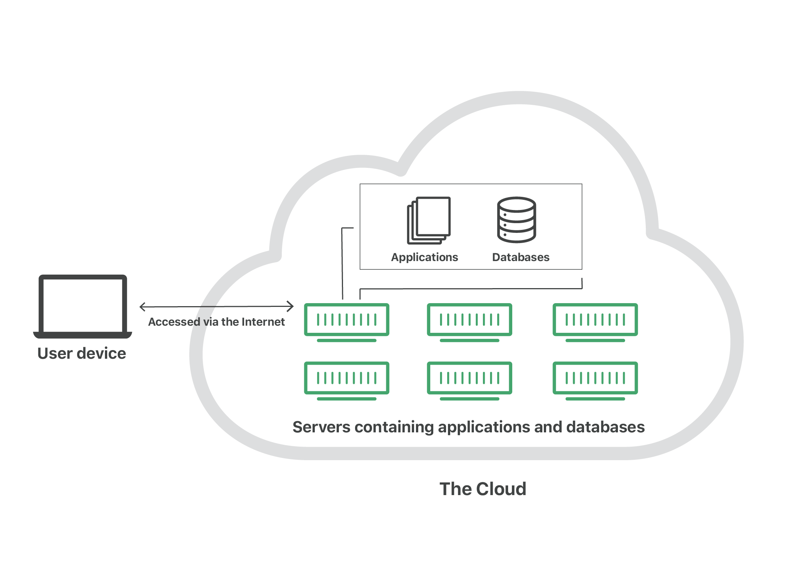

# Open Data for Cities and Climate

## Objectives

After completing this chapter, you will have an understanding of what open data is,
common formats and platforms for accessing open geospatial data, and how to evaluate the
quality and suitability of open datasets for local use.

## What is Open Data?

This is a book about using data to help cities make better decisions about climate risk.
While there are various potential sources for those data, in this book we focus on
*open* data. Toward the end of this chapter, we'll talk a bit about the complexities of
what open data look like in the real world, but for now we'll start with a basic working
definition that open data is data that anyone can "freely access, use, modify, and share
for any purpose."^[https://opendefinition.org/]. To clarify what this means, it might
help to begin with a couple of concrete examples. Here are some open data portals from
the U.S. government, the government of India, and the government of the City of Buenos
Aires:

| Portal                                                             | Description                        |
| ------------------------------------------------------------------ | ---------------------------------- |
| [data.gov](https://data.gov/)                                      | U.S. federal open data portal      |
| [data.gov.in](https://www.data.gov.in/)                            | India national open data portal    |
| [Catálogo de Datos GBA](https://catalogo.datos.gba.gov.ar/dataset) | Buenos Aires Province data catalog |

You'll notice that these portals are all government portals, which isn't an accident.
The idea of publicly-accessible data is old, but [the "open data"
movement](https://en.wikipedia.org/wiki/Open_data) tends to refer to a particular
initiative that emerged in the 2010s and focused primarily on open *government* data. As
such, national, regional, and local governments are some of the main publishers of open
data.

::: {.callout-tip}
## Try it yourself

Find an open data portal for your national, regional, or local government. What datasets
can you find in it? Is it well maintained? Can you find any datasets that you can see
yourself using for your work?
:::

Beyond governments, open data are often published by quasi-governmental institutions
like the United Nations, as well as by government-funded research organizations like the
European Research Commission's Joint Research Centre. Open data are also shared by many
scientific researchers, not just for reproducibility but for real-world use. Here are
some examples that are particularly relevant to urban climate
risk:^[Many of these sources also have plugins to import data directly in QGIS.]

| Source                                                                   | Description                                                                                                                 |
| ------------------------------------------------------------------------ | --------------------------------------------------------------------------------------------------------------------------- |
| [OpenStreetMap](https://www.openstreetmap.org/)                          | Community-generated geographic data; strong for roads and buildings in urban areas, but coverage and quality vary by region |
| [Overture Maps](https://docs.overturemaps.org/guides/)                   | Open map data combining contributions from multiple sources into a single, validated dataset                                |
| [Google Earth Engine](https://earthengine.google.com/)                   | Platform for satellite imagery and geospatial analysis; free for research and non-commercial use                            |
| [GEE Community Catalog](https://gee-community-catalog.org/)              | Community-curated datasets not in the official Earth Engine catalog; excellent for specialized climate data                 |
| [OpenLandMap](https://openlandmap.org/)                                  | Global environmental layers (soil, climate, vegetation) based on machine learning models                                    |
| [Source Cooperative](https://source.coop/)                               | Community-driven data catalog emphasizing cloud-native formats and open science                                             |
| [Microsoft Planetary Computer](https://planetarycomputer.microsoft.com/) | Curated earth observation data optimized for cloud-native analysis at scale                                                 |
| [TUM Global Building Heights](https://mediatum.ub.tum.de/1782307)        | Global building height dataset derived from remote sensing; useful for urban morphology and exposure modeling               |

As you can see, there's a *lot* of open data out there--and, in fact, the quantities of
available open data have been growing rapidly since the 2010s, and in particular now in
the age of cloud storage and artificial intelligence. This raises the question: with all
of that data out there, how do find what I need?

## Where is Open Data?

So far, we've looked at a couple of examples of *data portals*, which are a kind of
spatial data infrastructure (SDI). An SDI is basically any place where open geospatial
data is found on the internet. It can be a catalog, server, web application, list of
pages, or layers. A well-organized SDI makes it easy to find, access, and use open data,
but not all SDIs are created equal. In this chapter, we'll talk about navigating the SDI
landscape in order to find and access the data that you need. While this isn't a
comprehensive guide to all the different sources of open data, it will give enough
informaion to help you navigate and use common SDIs.

### Data Portals

A data portal is a website that provides access to datasets, often with search and
filtering capabilities. The purpose of a data portal is to make it easier for users to
discover and access datasets relevant to their needs, so they usually provide metadata,
such as descriptions, formats, and licensing information, and tools for previewing and
downloading the data. Open data portals are a great place to start your search for data,
as they're designed primarily for easily searching through a catalog (or catalogs) of
available data to find and acccess what you need. Usually, they'll include dataset
names, descriptions, metadata, and often some simple visualization feature that allows
you to preview the dataset before you commit to downloading it or connecting via server
or API (more on this in a moment).

::: {.column-margin}
**Metadata** is data that defines and describes other data. Usually it will include
information like the title, publisher, publication, and description date for a dataset.
It might also include schema information (i.e., what's *in* the data itself), update
frequency, licensing, contact information for the publisher, etc. Geospatial datasets
usually have [a unique set of metadata](https://www.fgdc.gov/metadata) such as their
bounding box and CRS.
:::

Let's take a look at an example. Here's a dataset of building demolitions listed on the
City of Philadelphia's open data portal:


This page lists several things we'd expect to see: a title, a brief description, some
metadata (created date, categories, a license, a maintainer and contact info). It also
lists several options for how to *access* the data, including a visualization page (the
HTML), an API (more on this in a moment), and three *flat file* formats (CSV, shapefile,
and GeoJSON).

### Flat Files

Simply put, a flat file is a file that you download once in its entirety. They can be
used offline with no internet connection, and they don't change unless the user manually
edits them. The major benefit of flat files is their simplicity; what you see is what
you get, and they are straightforward to access: you download them, search for them on
your computer, and open them with your desktop GIS software or with a programming
language.

Here's a quick example of accessing the buildings demolitions data as a flat file. We've
downloaded the data as a GeoJSON (one of several different vector data formats, such as
shapefile, GeoPackage, FileGeoDatabase, and GeoParquet) and saved it alongside this
book. Now we'll simply use the path to open it in Python with `geopandas` (see Chapter 1
for a recap of this) and we can explore the contents of the dataframe and map the
geometries.

```{python}
import geopandas as gpd

building_demos_url = "https://phl.carto.com/api/v2/sql?q=SELECT+*+FROM+demolitions&filename=demolitions&format=geojson&skipfields=cartodb_id"
building_demos = gpd.read_file(building_demos_url)

building_demos.head()

building_demos.plot()
```

::: {.callout-tip}
Raster data also come in flat files, such as GeoTIFFs, netCDF, and ECW. Just like vector
data, these can be downloaded and opened in Python, this time using `rasterio`.
:::

While both vector and raster data can come in several formats--each of which has its own
strengths and limitations--tools like `geopandas` and `rasterio` make it easy to open
all of these formats with a consistent interface. For example, you'd use
`gpd.read_file()` to open most kinds of vector data, whether they're stored as GeoJSON,
GeoPackage, or shapefile.

As we mentioned, flat files have the virtue of simplicity, and for many geospatial
practitioners, they will never need to go beyond downloading and analyzing flat files.
But what if we want to work with a dataset that updates regularly? What if we want only
*part* of a very large dataset, or we want to access the data *progammatically*, such as
in a script? These are cases where flat files can come up short, and where we might turn
instead to APIs.

### APIs

In the simplest terms, an API is a structured way to ask a computer for something and
get a response back.



Let's return to the example of our building demolitions data. When we right-click on the
link we used to download the GeoJSON file, we get the following URL:
`https://phl.carto.com/api/v2/sql?q=SELECT+*+FROM+demolitions&filename=demolitions&format=geojson&skipfields=cartodb_id`.
This reveals something interesting: the download link doesn't connect us to a flat file,
but a query pased via API to a database. In fact, if we change the `format` parameter in
the URL, we can get the same data in different formats (CSV, shapefile, GeoJSON) without
changing the underlying query. This is a common pattern for open data portals: the
portal itself is a user-friendly interface to a backend database that serves data
through an API. The API allows users to access the data programmatically, and often
provides more flexibility than downloading static files.

`https://phl.carto.com/api/v2/sql?q=SELECT+*,+ST_Y(the_geom)+AS+lat,+ST_X(the_geom)+AS+lng+FROM+demolitions&filename=demolitions&format=csv&skipfields=cartodb_id`
`https://phl.carto.com/api/v2/sql?q=SELECT+*+FROM+demolitions&filename=demolitions&format=shp&skipfields=cartodb_id`
`https://phl.carto.com/api/v2/sql?q=SELECT+*+FROM+demolitions&filename=demolitions&format=geojson&skipfields=cartodb_id`

Did you catch it? All three links are from the *same database*; the only thing that
changes is the *output file format*: CSV, shapefile, or GeoJSON. What are these, and why
do geospatial file formats matter?

Instead of downloading these data as a flat file, we can *query* them in Python to get
the same results:

```{python}
import requests
import geopandas as gpd

url = "https://phl.carto.com/api/v2/sql"
params = {
    "q": "SELECT * FROM demolitions",
    "format": "geojson",
    "skipfields": "cartodb_id",
}

response = requests.get(url, params=params)
gdf = gpd.GeoDataFrame.from_features(response.json())
gdf.plot()
```

There's an important distiction here: the results of the query will *change* as the
database is updated and our Python script is re-run, whereas the GeoJSON we downloaded
will not update--it's static.

In the case of the building demolitions data, we're connecting to a a PostGIS database
which can be queried via SQL. This is one flavor of API, but it's specific to Carto, the
vendor that provides it. In the open data world, you may run into many different kinds
of APIs, each with their own quirks. We can't be comprehensive, but let's take a look at
two more very common ones that are worth being familiar with.

#### WFS/WMS

Do you remember the `partidos` data we downloaded from the Province of Buenos Aires in
chapter 1 [link]? Let's take a look at a stripped-down version of that code:

```{python}
import requests
import geopandas as gpd

# We use requests instead of owslib here because owslib's WebFeatureService
# client doesn't support disabling SSL verification
url = "https://geo.arba.gov.ar/geoserver/idera/wfs"
params = {
    "service": "WFS",
    "version": "2.0.0",
    "request": "GetFeature",
    "typename": "idera:Departamento",
    "CQL_FILTER": "fna='Partido de La Plata'",
    "srsname": "EPSG:5347",
    "outputFormat": "application/json",
}

# verify=False because ARBA's SSL certificate is currently expired
response = requests.get(url, params=params, verify=False)
la_plata = (
    gpd.GeoDataFrame.from_features(response.json())
    .set_crs("EPSG:5347")
    .to_crs("EPSG:5348")
)
la_plata.plot()
```

At the beginnning of the query, we're connecting to something called a "Web Feature
Service", or WFS, which is another example of an API. In this case, a WFS is a
standardized way of sharing vector features over HTTPS.

In contrast to downloading a flat file, accessing these data via WFS allows us to
*pre-filter* them via our query to only return our features of interest. This is a much
more efficient way of accessing the data, especially when the underlying dataset is very
large and we only need a small portion of it for our own use. Here's an example with the
same dataset:

Let's make a small modification here: we can actually filter our *query* to return only
the Partido of La Plata, rather than *all* the partidos:

While it can take some adjustment to learn how to query WFS and WMS, they offer
flexibility, interoperability, programmatic access, automatic updates...

In many parts of the world--especially the Global South--they are *the* go-to for
sharing open data, and are therefore important to know how to use.

Along with WFS, the OGC has also defined the Web Map Service (WMS), which is the same
idea but for raster data.

#### Esri REST APIs

If you spend enough time working with geospatial data, you will inevitably come across
Esri. While Esri's products are proprietary, and *not* open source, they are so widely
used in the geospatial world that it's basically impossible not to encounter them at
some point. Much of the world's geospatial data is stored in Esri servers, and it's
therefore important to know how to access data via Esri's own API.

```{python}
import requests
import geopandas as gpd
from shapely.geometry import shape

url = "https://services.arcgis.com/fLeGjb7u4uXqeF9q/arcgis/rest/services/Council_Districts_2024/FeatureServer/0/query"
params = {
    "where": "1=1",
    "outFields": "*",
    "f": "geojson",
}

response = requests.get(url, params=params)
gdf = gpd.GeoDataFrame.from_features(response.json())
gdf.plot()
```

- mention the pagination issue

### Cloud Storage

So far, we've discussed flat files and APIs as two different ways to access open data.
These approaches work well for small- or medium-scale datasets, perhaps up to tens of
gigabytes. But modern geospatial workflows—including many of the ones we'll discuss in
this book—often involve *hundreds*, *thousands*, or even *millions* of gigabytes of
data. For workflows at this scale, traditional flat files and APIs simply aren't
appropriate; at best, they're slow and cumbersome, and at worst, they make certain tasks
literally impossible. This is where cloud storage and cloud-native file formats come in.

First, a definition: the **cloud** is nothing more than someone else's computer, servers
that your machine connects to over the internet. Accessing cloud infrastructure has an
initial learning curve, and it requires a consistent internet connection, but it offers
power, flexibility, scalability, and resilience that local storage cannot match.

[Add the little AWS graphic]

Here's a concrete example to illustrate the difference. Let's say Carolina works as a GIS analyst for her local municipality, and she's been asked to store 3.2 GB of cadastral data. Prior to cloud storage, she might need to purchase an external hard drive, which could cost $100 or more. The hard drive might hold 5 TB of data (or 5,000 GB), but if Carolina only ever uses 500 GB of that, she's paying for 4,500 GB she'll never use. On top of that, her options for sharing files are limited: she can either attach them to an email, if they're small enough, or copy them to a USB stick and pass it along by hand. And, perhaps worst of all, if she loses the hard drive or something happens to it, everything on it is gone—there's no backup, no distribution.

Contrast this with cloud storage. On platforms like Google Cloud or Amazon Web Services,
storage costs around $0.025 per GB per month. At that price, Carolina's 3.2 GB of
cadastral data would cost her just under a dollar ($0.96, to be exact) per year. If she
wants to share her data with a colleague, she can simply send them a URL to download or
query the data directly. And there's no risk of losing a hard drive, because she can
access her data from anywhere she can sign into her cloud account.

In recent years, several new file formats have emerged to make the most of the
advantages of cloud storage. These are called **cloud-optimized** (or cloud-native) file
formats, and they include cloud-optimized GeoTIFFs and Zarr for rasters, as well as
GeoParquet, FlatGeobuf, and PMTiles for vectors. (To read more about these, see the
[*Cloud-Optimized Geospatial Formats Guide*](https://guide.cloudnativegeo.org/).) You
can think of these as flat files, but *optimized* for use with cloud storage. Most
pertinently, this means that—unlike legacy file formats—they allow you to access and
process only the portions of data you actually need, through protocols like HTTP range
requests. Instead of having to download gigabytes of files, you can download just the
megabytes that matter to you, and you can do so very efficiently for your specific area
of interest. For our purposes, this is the main advantage. It's transformative for
working with large datasets: instead of downloading Argentina's entire building
footprint dataset, you can query just the buildings in La Plata.

Here's another example. We'll load the land cover data from the last chapter *for all of
Argentina*. Using a cloud-optimized GeoTIFF stored in a Google Cloud bucket, we simply
query the overview of the dataset, meaning a lower-resolution version of the raster
that's stored inside the same file alongside the full-resolution data. Cloud-optimized
GeoTIFFs bundle these pre-computed downsampled copies—sometimes called
pyramids—precisely so that tools can grab a coarse view of a huge dataset without
pulling the underlying pixels. For a country the size of Argentina, the full-resolution
land cover raster is many gigabytes, but the overview we need to render it on a map is
only a few megabytes. We make a single HTTP range request, pull just those bytes from
the Google Cloud bucket, and have a national land cover map in seconds.

```{python}
#| code-fold: true
#| code-summary: "Show visualization code"
import rioxarray as rio
import numpy as np
from matplotlib.colors import ListedColormap, BoundaryNorm

categories = {
    "Closed woody": {"ids": [3], "color": "#1f8d49"},
    "Open woody": {"ids": [4], "color": "#7dc975"},
    "Sparse woody": {"ids": [45], "color": "#807a40"},
    "Flooded woody": {"ids": [6], "color": "#026975"},
    "Flooded non-woody vegetation": {"ids": [11], "color": "#519799"},
    "Grassland": {"ids": [12], "color": "#d6bc74"},
    "Steppe": {"ids": [63], "color": "#ebf8b5"},
    "Pasture": {"ids": [15], "color": "#edde8e"},
    "Agriculture": {"ids": [18], "color": "#e974ed"},
    "Forest plantation": {"ids": [9], "color": "#7a5900"},
    "Shrub crop": {"ids": [36], "color": "#d082de"},
    "Agricultural mosaic": {"ids": [21], "color": "#ffefc3"},
    "Non-vegetated area": {"ids": [22], "color": "#d4271e"},
    "River, lake or ocean": {"ids": [33], "color": "#2532e4"},
    "Ice and surface snow": {"ids": [34], "color": "#93dfe6"},
    "Not observed": {"ids": [27], "color": "#ffffff"},
}

colors_by_id = {
    id_: info["color"] for info in categories.values() for id_ in info["ids"]
}
sorted_ids = sorted(colors_by_id.keys())
lc_cmap = ListedColormap([colors_by_id[i] for i in sorted_ids])
lc_norm = BoundaryNorm(sorted_ids + [max(sorted_ids) + 1], lc_cmap.N)
```

```{python}
suelo_2022_ruta = "https://storage.googleapis.com/mapbiomas-public/initiatives/argentina/collection-1/coverage/argentina_coverage_2022.tif"
overview = rio.open_rasterio(suelo_2022_ruta, overview_level=4).squeeze()
overview = overview.where((overview != 0) & (~np.isnan(overview)))

overview.plot(cmap=lc_cmap, norm=lc_norm, add_colorbar=False)
```

Cloud-native file formats are increasingly the standard in geospatial, offering improved
performance not only for large datasets in cloud storage, but also for simple, local
workflows, thanks to their improved compression and speed. They are especially relevant
for climate risk analysis, where we need to process large volumes of satellite, climate,
and geographic data without the infrastructure to store them locally. The cloud-native
tools we will use are not more difficult than traditional tools and offer many
advantages. The cloud is simply one of the places where people compute today. As
mentioned in [the introduction](../intro.qmd#guiding-principles), this book takes the
cloud-native approach as the default.

## Why Use Open Data?

## Data Quality and Fitness for Use

As the examples above suggest, there is a *lot* of open data in the world, and no two
datasets are quite alike. The definition we cited at the beginning of this chapter makes
the idea sound simple in theory, but in practice it gets complicated quickly. That's why
it's especially important to be able to carefully evaluate the quality and
trustworthiness of an open dataset before building anything on top of it.

When you encounter a new open dataset, there are several questions worth asking before
you commit to using it. None of them are particularly technical, but skipping them is
one of the most common ways that geospatial projects go wrong.

First, what **license** is the data shared under? Common open licenses like Creative
Commons (CC-BY, CC-BY-SA) and the Open Database License (ODbL) are generally permissive,
but not all licenses are equal, and many have specific requirements about how you use,
attribute, and share the data. Some specify how you must cite the source; others require
that derivative works carry the same license; still others restrict commercial use
entirely. Always check the license terms against your intended use case before you
invest time in a dataset, because discovering a licensing conflict after the fact can
mean throwing out weeks of work.

Second, how thorough is the **documentation**? Good documentation tells you who
published the data and when, provides contact information for the publisher, and
includes metadata describing how the dataset was produced, what its known limitations
are, and how its fields should be interpreted. Sparse documentation isn't necessarily
disqualifying, but it does mean you'll need to do more of the interpretive work
yourself, and you should weight the dataset accordingly.

Third, how well **maintained** is the dataset? How frequently is it updated, and when
was the last update? A dataset that hasn't been touched in five years may still be
useful, but you need to know that going in. Relatedly, when evaluating a data portal as
a whole, it's worth asking whether it's maintained by a stable institution—a national
mapping agency, an established research organization—or whether it depends on project
funding that may evaporate. Has the portal been operational for multiple years? Is there
a community of users around it whose work you can learn from? These questions help you
assess whether a source is reliable enough to base planning decisions on.

Fourth, how good is the **data quality** itself? Well-documented datasets publish
qualitative and quantitative assessments of accuracy, and the specific metrics vary
depending on the subject matter. But published metrics only get you so far. It's also
important to actually *look* at your data. Open the dataset in a map and compare it
against what you already know about the area. Does the land cover classification match
your understanding of the city? Do building footprints align with actual development
patterns? If you have local government data, even if it's somewhat out of date, compare
the two and pay attention to where they agree and where they diverge. Understanding
those differences is often more valuable than either dataset alone, because it tells you
what the global data can and cannot reliably tell you.

It's also worth reading the dataset's validation reports, when they exist, with an eye
to your specific region. If validation focuses on North America and Europe, the dataset
likely performs worse elsewhere—not because the producers are negligent, but because
that's where their training data and ground truth tend to be concentrated. And
resolution matters: a 30m global land cover dataset may be perfectly adequate for
regional analysis but entirely inappropriate for neighborhood-scale planning. Match the
data resolution to the scale of the decision you're trying to inform.

A related concept is **fitness for use**. A dataset might be highly accurate and still
be the wrong tool for the job, because accuracy is irrelevant if the data are applied to
a question they weren't designed to answer. This can get nuanced. When evaluating flood
risk in a coastal region, is coastal storm surge data enough, or do you also need data
on riverine and pluvial (rain-caused) flooding? Do you need climate change projections,
or are present-day data sufficient? The answer might depend on whether you're trying to
design a flood wall or relocate families living in informal settlements—two decisions
that demand very different evidence.

Ideally, datasets would include explicit guidance on what they should and shouldn't be
used for, but in practice this is rare. The best approach is to proceed with caution,
look for prior precedent of how the dataset has been applied, and consult subject matter
experts whenever you have doubts. Good geospatial work, in the end, depends as much on
knowing the limits of your data as on knowing how to process it.

### A Note on Global Datasets

In this book, we work primarily with *global* datasets, and it's worth pausing to say
something about what that means and where it gets complicated. Global datasets can be
enormously valuable, especially for filling gaps in countries that otherwise have no way
of collecting such data themselves. They make it possible to do meaningful analysis in
places where local data infrastructure is thin, and they provide a common baseline that
lets you compare conditions across regions. But "global" is a word that hides a lot of
variation, and these datasets come with limitations that are easy to overlook precisely
because the word sounds so comprehensive.

The first limitation is that global datasets are often not as global as they sound. Most
are produced by institutions and research groups based in wealthy countries—primarily in
North America, Europe, China, and Japan—and the underlying training data, ground truth,
and validation efforts tend to concentrate in those same regions. This isn't a matter of
bad faith on the part of the producers; it's a reflection of where data collection
infrastructure already exists. But the consequence is that "global" datasets are often
substantially better in some parts of the world than in others, and the gaps tend to
fall in exactly the places where local data is hardest to come by.

This leads directly to the second limitation, which is precision. Datasets derived from
machine learning models—and increasingly, that's most of them—are only as good as the
data they were trained on. Systematic bias in training data toward certain countries and
away from others means that models typically perform less accurately, and produce less
comprehensive results, in the regions where they're most needed. A building footprint
dataset trained primarily on aerial imagery from the United States and Western Europe
will struggle with the dense, irregular, and informal settlement patterns common in much
of the global south, even when the model is technically being applied "globally."

When you encounter a global dataset, then, the key question isn't whether it covers your
region, but *how well* it covers your region. Read the validation reports if they exist.
Look for accuracy assessments broken down by country or continent. Compare the dataset
against any local data you can get your hands on, even informally, and see whether the
patterns line up. Ask whether anyone working in your context has used this dataset
before, and what they found. The goal isn't to dismiss global datasets, which remain
genuinely useful, but to develop a calibrated sense of what they can and can't tell you
about your specific place.

(Note, too, that global datasets can often be *better* than local; cite my example of
the building footprints in La Plata)

The takeaway is that global datasets are tools, not truth. They provide starting points
and regional context, but they require critical evaluation before use in local
decision-making. When the quality of a global dataset turns out to be insufficient for
your needs, the right move is often a hybrid approach: use the global data as a
baseline, supplement it with local data collection where you can, and focus targeted
effort on collecting the specific high-priority information your decisions actually
depend on.

### Challenges to the Open Data Ecosystem

When you go looking for data to inform a real decision, you'll quickly discover that
"open" doesn't always mean "usable." A dataset can have an open license and a public
download link and still be effectively out of reach—maybe it takes a full day to
download, requires a terabyte of free local storage, depends on expensive proprietary
software, or has no documentation in a language anyone on your team reads. The questions
that determine whether a dataset will actually help you don't show up in the license: Is
it in a format you can open? Is it documented well enough to interpret? Is it hosted
somewhere you can reliably reach? Is anyone going to keep maintaining it next year?

The harder version of this problem is institutional. A great deal of the open data that practitioners around the world rely on—weather forecasts, hurricane models, long-range climate projections—comes from a small number of public institutions whose continued existence we used to take for granted. NOAA is the clearest example: its data products underlie property insurance, shipping, agriculture, aviation, and most of the climate models built on top of them, returning roughly $73 in savings for every dollar invested in its forecasts alone. And yet, as [ProPublica reported in 2025](https://www.propublica.org/article/trump-noaa-budget-cuts-climate-change-modeling-princeton-gfdl), the Trump administration has proposed cutting NOAA's funding by 27%, with a 74% cut to the office that houses the Geophysical Fluid Dynamics Laboratory at Princeton—the lab whose models feed hurricane forecasts, the National Weather Service, and much of the world's climate prediction work. NASA, NSF, and DOE modeling programs face similar pressures. Any workflow that quietly depends on a single agency staying funded forever is more fragile than it looks.

The encouraging news is that people are actively working on what comes next. Jed
Sundwall of Radiant Earth has
[argued](https://radiant.earth/blog/2025/03/building-resilient-data-infrastructure/)
that the right response isn't just to defend the institutions we inherited but to build
new ones designed from the start to be resilient: cooperatively governed,
internationally distributed, built on open source code and cloud-native formats, and
structured so that a political shock in any one country can't take down the data the
rest of the world depends on. Efforts like the Cloud-Native Geospatial Forum, Source
Cooperative, the Overture Maps Foundation, and OpenStreetMap are early experiments in
what this can look like. For you as a practitioner, the implication is twofold: when
choosing data for real decisions, look past the license and ask who's behind it and what
your alternatives would be if it went away; and when you have a choice, use and support
the newer, more resilient sources, because the long-term health of the open data we all
rely on will be shaped by which efforts get built upon.

## Additional Resources
