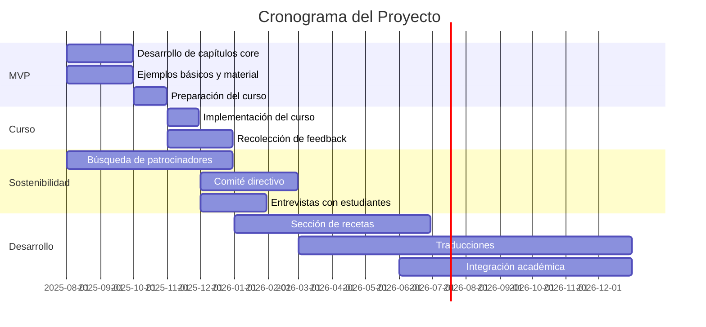

# Hoja de Ruta

## 🎯 Objetivo General
Desarrollar un libro de código abierto sobre datos geoespaciales en español, comenzando con un MVP para un curso de noviembre 2025 y evolucionando hacia un recurso sostenible a largo plazo.

## 📅 Cronograma del Proyecto

## 🚀 Fases del Desarrollo

### **Fase 1: MVP (Agosto-Septiembre 2025)**
- **Capítulos conceptuales core** con ejemplos iniciales
- **Material básico** y estructura del libro
- **Solo en español** (compromiso prioritario)
- **Preparación para curso** de noviembre

### **Fase 2: Implementación del Curso (Noviembre 2025)**
- **Enseñanza del material** desarrollado
- **Recolección de feedback** de estudiantes
- **Identificación de mejoras** necesarias

### **Fase 3: Sostenibilidad (Diciembre 2025-Febrero 2026)**
- **Búsqueda de patrocinadores institucionales**
- **Formación del comité directivo**
- **Entrevistas con estudiantes** para mejoras

### **Fase 4: Expansión (2026)**
- **Sección de recetas** con ejemplos reales
- **Traducciones** (inglés, francés, idiomas ONU)
- **Integración en cursos académicos**
- **Mantenimiento del código** y actualizaciones

## 🎯 Resultados Esperados

**Corto plazo (2025):**
- MVP funcional para el curso
- Estructura core del libro completa

**Mediano plazo (2026):**
- Comité directivo establecido
- Sección de recetas implementada
- Traducciones iniciadas

**Largo plazo (2027+):**
- Recurso sostenible y mantenido
- Múltiples idiomas disponibles
- Integración académica amplia